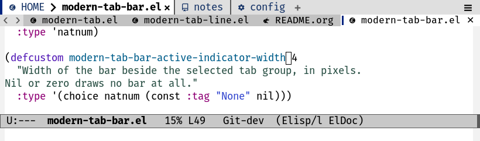
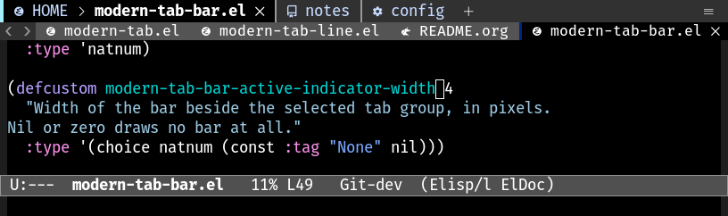

# Inspired by: https://github.com/othneildrew/Best-README-Template
#+OPTIONS: toc:nil

[[https://github.com/MArpogaus/modern-tabs/graphs/contributors][https://img.shields.io/github/contributors/MArpogaus/modern-tabs.svg?style=flat-square]]
[[https://github.com/MArpogaus/modern-tabs/network/members][https://img.shields.io/github/forks/MArpogaus/modern-tabs.svg?style=flat-square]]
[[https://github.com/MArpogaus/modern-tabs/stargazers][https://img.shields.io/github/stars/MArpogaus/modern-tabs.svg?style=flat-square]]
[[https://github.com/MArpogaus/modern-tabs/issues][https://img.shields.io/github/issues/MArpogaus/modern-tabs.svg?style=flat-square]]
[[https://github.com/MArpogaus/modern-tabs/blob/main/COPYING][https://img.shields.io/github/license/MArpogaus/modern-tabs.svg?style=flat-square]]
[[https://github.com/MArpogaus/modern-tabs/actions/workflows/test.yml][https://img.shields.io/github/actions/workflow/status/MArpogaus/modern-tabs/test.yml.svg?branch=main&label=tests&style=flat-square]]
[[https://linkedin.com/in/MArpogaus][https://img.shields.io/badge/-LinkedIn-black.svg?style=flat-square&logo=linkedin&colorB=555]]

* Modern Tabs :TOC_3_gh:noexport:
  - [[#about-the-project][About The Project]]
  - [[#getting-started][Getting Started]]
    - [[#installation][Installation]]
    - [[#usage][Usage]]
  - [[#customization][Customization]]
    - [[#the-indicator][The Indicator]]
    - [[#the-tab-bar][The Tab Bar]]
    - [[#the-tab-line][The Tab Line]]
  - [[#development][Development]]
  - [[#contributions][Contributions]]
  - [[#license][License]]
  - [[#contact][Contact]]

** About The Project

Emacs has two rows of tabs.  The =tab-bar= shows one tab per tab or tab
group; the =tab-line= shows one tab per buffer of a window.  This
package gives both the look of the editors people come here from: a
coloured indicator beside the selected tab, an icon on every tab, and —
on the tab line — a close button that buries a buffer another window
still shows and kills one no window shows.

The two modes are independent.  The five indicator options are named
the same in both; the rest differ, because the two rows name their tabs
differently — the tab bar keys its icons on the name of a group, the
tab line asks a function for the icon of a buffer.

Icons come from [[https://github.com/rainstormstudio/nerd-icons.el][nerd-icons]] where it is installed.  A graphic frame
shows the first glyph of a candidate list as it is — which fonts draw
it is the frame's business, fallbacks included.  A terminal refuses a
private use glyph (that is where a nerd font keeps its own) and takes
the first plain candidate it can encode, so one daemon serves a graphic
frame and a terminal frame at once.  A symbol a UTF-8 terminal can
encode but its font has no glyph for still shows a box: name plain
strings in the icon options there.

** Getting Started

*** Installation

The package needs Emacs 29.1 or later and nothing else.  nerd-icons is
optional: install it for the glyphs, or name plain strings in the icon
options.

The package is =modern-tab=, after its main file, and every symbol
carries that name as its prefix.  The repository is =modern-tabs=,
because it holds the two rows of tabs Emacs has.  Both modes are
autoloaded, so nothing needs requiring:

#+begin_src emacs-lisp
  (use-package modern-tab
    :vc (:url "https://github.com/MArpogaus/modern-tabs" :rev :newest)
    :hook ((after-init . modern-tab-bar-mode)
           (after-init . modern-tab-line-mode)))
#+end_src

Drop either hook to run one mode alone.  The rows themselves stay
yours: turn on =tab-bar-mode= and =global-tab-line-mode= where you want
them.

*** Usage

=M-x modern-tab-bar-mode= dresses the tab bar.  Turn on =tab-bar-mode=
to see it.

=M-x modern-tab-line-mode= dresses the tab line.  Turn on
=tab-line-mode= or =global-tab-line-mode= to see it — the row is yours,
and this mode neither enables nor disables it.  A window showing one
buffer hides its tab line; set =modern-tab-line-auto-hide= to nil to
keep the row.

Each mode also sets what Emacs draws its row with — the tab bar's
separator and its automatic width, the tab line's separator and which
of its buttons show — and gives every one of them back when it is
turned off.

On a terminal the tab bar shows no menu button, whatever
=modern-tab-bar-format= says.  See [[file:docs/implementation.org][docs/implementation.org]] for the
measurement behind that.

** Customization

*** The Indicator

The indicator is the vertical bar beside a tab.  Each mode names five
options for it: a width and a colour for the selected tab, a width and
a colour for the others, and one height for both.  The two modes use
the same names, with =modern-tab-bar-= or =modern-tab-line-= in front.

| Option                                      | Default              |
|---------------------------------------------+----------------------|
| =modern-tab-bar-active-indicator-width=     | ~4~, in pixels       |
| =modern-tab-bar-inactive-indicator-width=   | ~2~, in pixels       |
| =modern-tab-bar-active-indicator-color=     | ~mode-line-emphasis~ |
| =modern-tab-bar-inactive-indicator-color=   | ~shadow~             |
| =modern-tab-bar-indicator-height=           | ~25~, in pixels      |
| =modern-tab-line-active-indicator-width=    | ~3~, in pixels       |
| =modern-tab-line-inactive-indicator-width=  | ~0~, in pixels       |
| =modern-tab-line-active-indicator-color=    | ~mode-line-emphasis~ |
| =modern-tab-line-inactive-indicator-color=  | ~shadow~             |
| =modern-tab-line-indicator-height=          | ~20~, in pixels      |

A width of nil or zero draws no indicator at all.  A colour is a colour
name or a face, whose foreground is then the colour.  A frame without
images draws one column of a vertical line instead.

*** The Tab Bar

| Option                             | What it says                                  |
|------------------------------------+-----------------------------------------------|
| =modern-tab-bar-icons=             | the icon each group name shows, an alist       |
| =modern-tab-bar-default-icon=      | the icon a group with no match shows           |
| =modern-tab-bar-group-name-function= | rewrites the name of a group                 |
| =modern-tab-bar-new-command=       | what the new button runs                       |
| =modern-tab-bar-new-glyphs=        | the new button, best glyph first               |
| =modern-tab-bar-close-glyphs=      | the close button, best glyph first             |
| =modern-tab-bar-current-glyphs=    | the mark on the selected tab, best first       |
| =modern-tab-bar-menu-glyphs=       | the menu button, best glyph first              |
| =modern-tab-bar-format=            | what the bar shows, as =tab-bar-format= takes it |

An icon is a string shown as it is, or a plist naming a nerd-icons
glyph:

#+begin_src emacs-lisp
  (setopt modern-tab-bar-icons
          '(("HOME"      :style "suc" :icon "custom-emacs")
            ("^\\[P\\]"  :style "oct" :icon "repo")
            ("config"    :style "md"  :icon "cog")))
#+end_src

The first pattern that matches the group name wins, and the patterns
are matched with the case rules of whoever wrote them.

The =:style= is the middle of a nerd-icons function name — =oct= for
=nerd-icons-octicon=, =md= for =nerd-icons-mdicon= — and the =:icon= is
the glyph name without its =nf-<style>-= front.  =M-x
nerd-icons-insert= lists what there is.

*** The Tab Line

| Option                           | What it says                             |
|----------------------------------+------------------------------------------|
| =modern-tab-line-icon-function=  | the icon of a tab, called with its buffer |
| =modern-tab-line-close-glyphs=   | the close button, best first              |
| =modern-tab-line-auto-hide=      | whether a window with one buffer hides the row |

The close button buries the buffer where another window still shows
it, kills it where none does, and deletes the window with its last tab.
=modern-tab-line-close-tab= is that command, should you want it on a
key.

An icon function is called with a buffer and returns a string, or nil
for no icon.  =modern-tab-glyph= names a preferred glyph and a
fallback, and =modern-tab-icon-for= keeps the answer — it calls a
function only where it has none yet:

#+begin_src emacs-lisp
  (defun my/tab-icon (buffer)
    (modern-tab-icon-for (buffer-name buffer)
                         (if (buffer-modified-p buffer) "● " "  ")))

  (setopt modern-tab-line-icon-function #'my/tab-icon)
#+end_src

** Development

| Target     | What it does                             |
|------------+------------------------------------------|
| =compile=  | byte-compile, warnings are errors        |
| =lint=     | package-lint, the rules MELPA applies    |
| =relint=   | the regular expressions                  |
| =test=     | ERT suite                                |
| =clean=    | remove build output and the tool sandbox |

Plain =make= runs the checks in that order, exactly as the CI does.
The indent, checkdoc and complexity checks are pre-commit hooks of
[[https://github.com/MArpogaus/emacs-pre-commit-hooks][emacs-pre-commit-hooks]]: indent gives Lisp the indentation =indent-region=
gives it, each file loaded first, checkdoc reads the documentation
strings, and complexity stops a commit where a function costs a reader
more than fifteen.  Check-declare and melpazoid join them before a
push, the first saying where a declare-function has gone stale, the
second reading the package as a MELPA reviewer would.  See
[[file:docs/implementation.org][docs/implementation.org]] for how the two modes are built.

** Contributions

Contributions are greatly appreciated!  Feel free to check the
[[https://github.com/MArpogaus/modern-tabs/issues][issues page]] or submit a [[https://github.com/MArpogaus/modern-tabs/pulls][pull request]].

** License

Distributed under the [[file:COPYING][GPLv3]] License.

** Contact

[[https://github.com/MArpogaus/][Marcel Arpogaus]] - [[mailto:znepry.necbtnhf@tznvy.pbz][znepry.necbtnhf@tznvy.pbz]] (encrypted with [[https://rot13.com/][ROT13]])

Project Link: [[https://github.com/MArpogaus/modern-tabs][https://github.com/MArpogaus/modern-tabs]]
